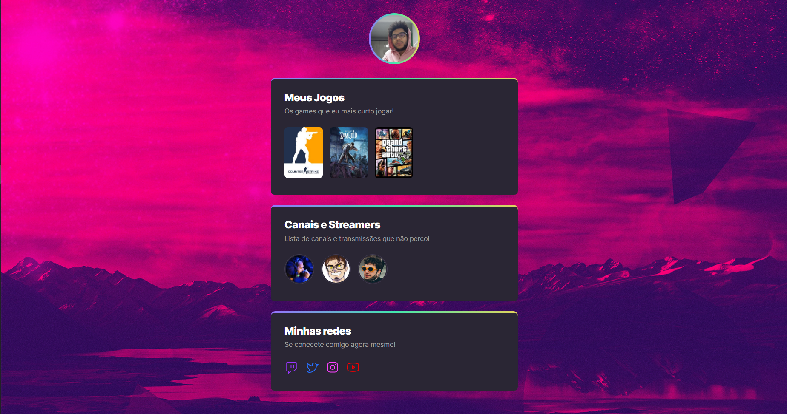
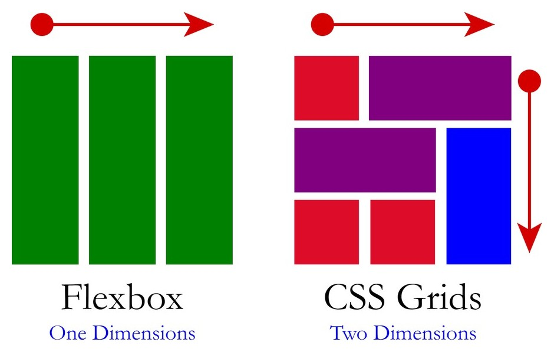

# nlw-sports-explorer

## **PREVIEW**

Projeto construído no evento Next Level Week da Rocketseat.



## **OBJETIVO**

Criar uma página onde se possa ver os seus jogos e streamers favoritos, além de poder compartilhar suas redes sociais.

## **TECNOLOGIAS**

- HTML
- CSS
- Git e GitHub

## **CRONOGRAMA**

- Dia 01 - Base Building;

  - Introdução do que será feito na semana

- Dia 02 High Speed

  - [HTML](#html-hypertext-markup-language)
  - [Tags Mencionadas na aula](#tags-mencionadas-na-aula)
  - [Outras Tags]()

- Dia 03 - To be continued (CSS);

  - [CSS](#css-cascading-style-sheets)
  - [Reset](#reset)
  - [Display](#css-display)

- [Dia 04 - Power UP]()

  - [BEM](#bem)
  - [CSS Animations](#css-animations)
  - [CSS Transitions](#css-transitions)

- Dia 05 - Final Round
  - [Git](#git)

## **HTML (HyperText Markup Language)**

Estrutra básica de construção WEB. É uma forma de marcação de texto utilizada para a interpretação do texto pelo navegador

### **TAGS**

São elementos HTML que servem para a marcação de texto, são utilziados pelos os leitores de tela, além de facilitar na organização do código.

#### Tags mencionadas na aula

- <**html\> →** Representa a raiz de um documento HTML, todas as demais tags são derivadas desse elemento, ou seja, estão contidas dentro dele;
- **<head\> →** Esta tag irá conter os elementos que serão lidos pela máquina através das meta tags, tais elementos ajudam a página a performar melhor no SEO;
  - **<meta\> →** Define qualquer informação de metadados que não possam ser definidos por outros elementos HTML;
  - **<link\> →** Especificam as relações entre o atual documento com outros documentos, seja no mesmo projeto, como em locais externos**;**
  - **<title\> →** Define o título do documento, aquele que é mostrado na barra de título de um navegador;
- **<header\> →** Representa o conteúdo de introdução
- **<body\> →** Representa o conteúdo do documento HTML;
  - **<main\> →** Esta _tag_ indica o conteúdo principal do site, é aqui onde estará contido a maior parte das _tags_ de uma aplicação;
  - **<section\> →** Elemento genérico para representar uma secção em um documento HTML;
  - **<h\_\> →** Representa o título e seu nível de hierarquia, onde o mais alto é o <h1\> e o mais baixo <h6\>;
  - **<p\> →** Conhecido como a _tag_ de parágrafo, é utilizada para agrupar conteúdos de texto;
  - **<a\> →** Tag de âncora, cria conexões tanta internas.

## **CSS (Cascading Style Sheets)**

Utilizado para a apresentação visual da página, onde se irá estilziar os elementos HTML

```CSS
body{
  background: red;
  /* Isso é um comentário*/
}
```

### **Princípios**

- **Declaração →** Pedaço do código que irá ditar as propriedades e valores a serem aplicados em um elemento HTML;
- **Seletores →** São valores de seleção, ou seja, qual elemento HTML será selecionado para estilização. Geralmente é utilizado o atributo _class_ do elemento para a seleção, mas nada impte que se utilize _tags_, _IDs_, ou outras propriedades:
  - **Epecificidade dos Seletores →** ID > Atributos > Class > Tags;
- **Propriedade →** Qual a propriedade que será modificada no seletor;
- **Valores →** Qual valor a propriedade irá receber;
- **Comentários →** Se encontra em "/_ /_", e são utilizados para ignorar certa parte do código e fazer anotações;
- **Cascata →** Característica do CSS para a sua aplicação de estilos, onde a ordem e a espeficicade importam.

### **Reset**

Por default, as _tags_ do HTML já possuem alguns estilos de CSS pré-estabelecidos, o que pode vir a fazer o desenvolvedor perder o controle dos estilos. Por isso é comum realizar o reset das definições, onde se cria um file 'zerando' os estilos desejados.

```CSS
* {
  margin: 0;
  padding: 0;
  box-sizing: border-box;
}
```

### **CSS Display**

É uma propriedade que especifica a disposição da renderização do elemento em tela. Os principais _displays_ utilizaodos para o desenvolvimento são o Flexbox e Grid, mas existem diversos outros, que são utilizados muitas vezes de forma default por algumas _tags_, como o block, inline, e inline-block.



## **Power Up**

### **BEM**

Para facilitar o desenvolvimento e a manutenção do CSS em aplicações existem diversas metodologias e convenções, e uma delas é o BEM. Também conhecido como _Block Element Modifier_ (Bloco Elemento Modificador), consiste em dividir suas classes do HTML em três categorias, como o próprio nome menciona, blocos, elementos e modificadores.


-**Bloco:** Unidade independente, uma parte mais geral, conglomerado de outros elementos ; -**Elemento:** Faz parte do bloco, pode ser visto como um elemento filho. Ele não possui um significado quando visto separadamente, só faz sentido em conjunto com outros elementos formando um bloco. Sua sintaxe é escrita com um double underline após o nome do bloco a qual o elemento pertence. ( \_\_element ); -**Modificador:** Vem em “adição” ao elemento, serve para mudar algum atributo de certo elemento.

```CSS
.block {
	width: 600px;

	display:grid;
	grid-template-columns:1fr 1fr
}

.block__element {
	font-size: 24px;
  font-weight: 900;
  letter-spacing: -0.47px;
	color: white;
}

.block__element--modifier {
	font-size: 16px;
	color: black;
}
```

## CSS Animations

Torna possível a criação de animações via CSS, através da mudança de estilos de forma fluída. Consiste em dois parâmetros, um descrevendo os estilos e outro indicando os keyframes da animação.

```CSS
@keyframes nomeDaAnimação {
		from {
	opacity: 0;
	}
		to {
	opacity: 1
	}
}

/*or*/

@keyframes nomeDaAnimação {
		0%{
	opacity: 0;
	}
		50%{
	opacity: 1
	}
		100%{
	opacity: 1
	}
}
```

### **Vantagens**

- Não há necessidade da utilização de JavaScript;
- Melhor performance e eficiência na execução da animação;

### **Configurações**

- **animation-delay:** O tempo em que o elemnto é carregado e o inicio da sequência de animação;
- **animation-direction:** Define se a animação deve seguir o fluxo até o final da sequência ou voltar ao ponto inicial e se repetir;
- **animation-durantion:** Quanto tempo a animação deve durar para realizar um ciclo completo;
- **animation-iteration-count:** Número de vezes que se repete;
- **animation-name:** Especifica qual animação deve seguir as regras;
- **animation-play-state:** Permite pausar e resumir a sequência da animação;
- **animation-timing-function:** Configura a sincronização da animação, como ela transitar através dos keyframes;
- **animation-fill-mode:** Configura que valores são aplicados pela animação antes e depois de se executar.

## CSS Transitions

As transições do CSS são recursos para dar uma maior vida as páginas webs, com elas podemos fazer diversas transições nos elementos HTML. Através das transições podemos controlar as mudanças de “estado” do CSS, tanto das propriedades, quanto das animações.

- **transitions-property:** Especifica o nome(s) das propriedades do CSS que deve ser aplicado os parâmetros; \*\*\*\*
- **transitions-duration:** Especifica a duração que a transição deve ocorrer.
- **transition-timing-function:** Define como os valores intermediários das propriedades devem ser calculados;
- **transition-delay:** Define por quanto tempo se deve esperar para que a transição comece a ocorrer.

## Git

É um sistema de controle de versão distribuído, é através do Git que é possível salvar diversas versões das aplicações e sempre que necessário registrar e consultar o histórico, podendo editar qualquer tipo de arquivo. Existem diversas plataformas para salvar as versões do código remotamente, a mais famosa é o GitHub.

```Bash
$ git init
$ git branch
$ git add . # Logo após o add, se especifica o que deseja adicionar no repositório
$ git commit -m "Any text to the commit"
$ git log
$ git merge
$ git pull
$ git push
$ git clone
$ git remote
$ git status
$ git config
$ git clean
```

- **init:** Inicia um novo repositório git;
- **branch:** é o ramo em que esta desenvolvendo. Permite criar ambientes de desenovlvimento isolados dentro de um mesmo repositório;
- **add:** Adicionar ao repositórios os arquivos desejados;
- **commit:** Em cojunto com o “git add”, permite acompanhar diferentes etapas do projeto;
- **log:** Permite explorar as revisões anteriores do projeto;
- **merge:** Maneira de integrar as mudanças das demais branchs;
- **pull:** Puxa automaticamente a última versão do seu projeto no repositório linkado;
- **push:** O oposto ao pull, sobe para o repositório linkado a versão local do branch;
- **clone:** Permite clonar um repositório;
- **remote:** Ferramente para administrar as conexões remotas. Permite usar atalhos para manusear suas conexões ao invés de passar toda a URL;
- **status:** Mostra o estado dos arquivos do atual diretório;
- **config:** Maneira de configurar as opções do Git. Geralmente é usado somente uma vez após a instalação do Git;
- **clean:** Remove diretórios que não estão rastreados do diretório de trabalho.

## **Aprendizados**

- Tags HTML e Semântica;
- CSS display;
- CSS transitions;
- CSS Animações;
- BEM;
- Git com CLI

## **Próximos Passos**

- Criar um CRUD a partir do layout montado;
- Utilizar API da [twitch](https://dev.twitch.tv/docs/api/)

## **Referênicias**

[Tags HTML](https://developer.mozilla.org/pt-BR/docs/Web/HTML/Element)

[CSS Especificidade](https://developer.mozilla.org/en-US/docs/Web/CSS/Specificity)

[CSS Display](https://developer.mozilla.org/pt-BR/docs/Web/CSS/display)

[BEM](https://desenvolvimentoparaweb.com/css/bem/)

[CSS Animation](https://developer.mozilla.org/en-US/docs/Web/CSS/CSS_Animations/Using_CSS_animations)

[CSS Transition](https://developer.mozilla.org/en-US/docs/Web/CSS/CSS_Transitions/Using_CSS_transitions)
